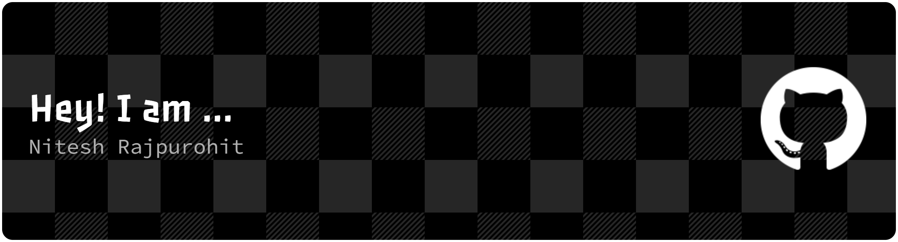

<!-- Banner GIF: upload a banner.gif to your profile repo, or replace with any tech gif -->

<h1 align="center">Hey 👋, I'm Nitesh Rajpurohit</h1>

  <b>Artifical Intelligence & Data Science Student @ VIT Pune &nbsp;·&nbsp; Full-Stack Developer &nbsp;·&nbsp; Agentic AI Builder</b>

  
  
  

-- --

I'm passionate about building production-grade full-stack applications and intelligent AI systems that solve real-world problems. My interests span across software engineering, backend development, system design, machine learning, and modern AI technologies. I enjoy turning ideas into scalable, efficient, and user-focused products while maintaining clean architecture and high-quality code.

With a LeetCode Knight rating of 1872+ and 1200+ DSA problems solved, I bring strong problem-solving skills and a solid computer science foundation to every project I build. I'm constantly exploring new technologies, contributing to impactful projects, and pushing myself to grow as an engineer.

Always open to collaborating, learning, and building something meaningful. Let's connect and create innovative solutions together! 🌟

---

## 👨‍🚀 Mission Log

> *"Crafting scalable backend platforms and AI-driven solutions that solve real-world problems."*

- 🌌 Exploring **Agentic AI systems** with LangGraph, LangChain & MCP
- ⚡ Building **production-grade backends** with Django REST Framework & scalable APIs
- 🛰️ Solving real-world problems through **AI-powered full-stack platforms**
- 🧪 Experimenting with **multi-agent orchestration, RAG pipelines & vector databases**
- 🧩 Obsessed with clean architecture, **DSA**, and systems that just work

---

## 🏅 Achievements
<!-- ===== Languages ===== -->

  <!-- C -->
  

  <!-- Java -->
  

  <!-- Python -->
  

  <!-- JavaScript -->
  

  <!-- TypeScript -->
  

  <!-- PHP -->
  

  <!-- Dart -->
  

  <!-- ===== Frontend ===== -->

  <!-- HTML5 -->
  

  <!-- CSS3 -->
  

  <!-- Bootstrap -->
  

  <!-- React -->
  

  <!-- React Native -->
  

  <!-- Flutter -->
  

  <!-- Figma -->
  

  <!-- Django -->
  

  <!-- Flask — FIXED URL -->
  

  <!-- Express -->
  

  <!-- Node.js -->
  

  <!-- GraphQL -->
  

  <!-- WebSocket -->
  

  <!-- Nginx -->
  

  <!-- Android -->
  

  <!-- LangChain -->
<!-- LangChain (inline SVG) -->
<!-- <a href="https://www.langchain.com/" target="_blank" rel="noreferrer">
  <svg role="img" viewBox="0 0 24 24" xmlns="http://www.w3.org/2000/svg" height="40" width="40" alt="langchain">
    <path d="M6.0988 5.9175C2.7359 5.9175 0 8.6462 0 12s2.736 6.0825 6.0988 6.0825h11.8024C21.2641 18.0825 24 15.3538 24 12s-2.736 -6.0825 -6.0988 -6.0825ZM5.9774 7.851c0.493 0.0124 1.02 0.2496 1.273 0.6228 0.3673 0.4592 0.4778 1.0668 0.8944 1.4932 0.5604 0.6118 1.199 1.1505 1.7161 1.802 0.4892 0.5954 0.8386 1.2937 1.1436 1.9975 0.1244 0.2335 0.1257 0.5202 0.31 0.7197 0.0908 0.1204 0.5346 0.4483 0.4383 0.5645 0.0555 0.1204 0.4702 0.286 0.3263 0.4027 -0.1944 0.04 -0.4129 0.0476 -0.5616 -0.1074 -0.0549 0.126 -0.183 0.0596 -0.2819 0.0432a4 4 0 0 0 -0.025 0.0736c-0.3288 0.0219 -0.5754 -0.3126 -0.732 -0.565 -0.3111 -0.168 -0.6642 -0.2702 -0.982 -0.446 -0.0182 0.2895 0.0452 0.6485 -0.231 0.8353 -0.014 0.5565 0.8436 0.0656 0.9222 0.4804 -0.061 0.0067 -0.1286 -0.0095 -0.1774 0.0373 -0.2239 0.2172 -0.4805 -0.1645 -0.7385 -0.007 -0.3464 0.174 -0.3808 0.3161 -0.8096 0.352 -0.0237 -0.0359 -0.0143 -0.0592 0.0059 -0.0811 0.1207 -0.1399 0.1295 -0.3046 0.3356 -0.3643 -0.2122 -0.0334 -0.3899 0.0833 -0.5686 0.1757 -0.2323 0.095 -0.2304 -0.2141 -0.5878 0.0164 -0.0396 -0.0322 -0.0208 -0.0615 0.0018 -0.0864 0.0908 -0.1107 0.2102 -0.127 0.345 -0.1208 -0.663 -0.3686 -0.9751 0.4507 -1.2813 0.0432 -0.092 0.0243 -0.1265 0.1068 -0.1845 0.1652 -0.05 -0.0548 -0.0123 -0.1212 -0.0099 -0.1857 -0.0598 -0.028 -0.1356 -0.041 -0.1179 -0.1366 -0.1171 -0.0395 -0.1988 0.0295 -0.286 0.0952 -0.0787 -0.0608 0.0532 -0.1492 0.0776 -0.2125 0.0702 -0.1216 0.23 -0.025 0.3111 -0.1126 0.2306 -0.1308 0.552 0.0814 0.8155 0.0455 0.203 0.0255 0.4544 -0.1825 0.3526 -0.39 -0.2171 -0.2767 -0.179 -0.6386 -0.1839 -0.9695 -0.0268 -0.1929 -0.491 -0.4382 -0.6252 -0.6462 -0.1659 -0.1873 -0.295 -0.4047 -0.4243 -0.6182 -0.4666 -0.9008 -0.3198 -2.0584 -0.9077 -2.8947 -0.266 0.1466 -0.6125 0.0774 -0.8418 -0.119 -0.1238 0.1125 -0.1292 0.2598 -0.139 0.4161 -0.297 -0.2962 -0.2593 -0.8559 -0.022 -1.1855 0.0969 -0.1302 0.2127 -0.2373 0.342 -0.3316 0.0292 -0.0213 0.0391 -0.0419 0.0385 -0.0747 0.1174 -0.5267 0.5764 -0.7391 1.0694 -0.7267m12.4071 0.46c0.5575 0 1.0806 0.2159 1.474 0.6082s0.61 0.9145 0.61 1.4704c0 0.556 -0.2167 1.078 -0.61 1.4698v0.0006l-0.902 0.8995a2.08 2.08 0 0 1 -0.8597 0.5166l-0.0164 0.0047 -0.0058 0.0164a2.05 2.05 0 0 1 -0.474 0.7308l-0.9018 0.8995c-0.3934 0.3924 -0.917 0.6083 -1.4745 0.6083s-1.0806 -0.216 -1.474 -0.6083c-0.813 -0.8107 -0.813 -2.1294 0 -2.9402l0.9019 -0.8995a2.056 2.056 0 0 1 0.858 -0.5143l0.017 -0.0053 0.0058 -0.0158a2.07 2.07 0 0 1 0.4752 -0.7337l0.9018 -0.8995c0.3934 -0.3924 0.9171 -0.6083 1.4745 -0.6083zm0 0.8965a1.18 1.18 0 0 0 -0.8388 0.3462l-0.9018 0.8995a1.181 1.181 0 0 0 -0.3427 0.9252l0.0053 0.0572c0.0323 0.2652 0.149 0.5044 0.3374 0.6917 0.13 0.1296 0.2733 0.2114 0.4471 0.2686a0.9 0.9 0 0 1 0.014 0.1582 0.884 0.884 0 0 1 -0.2609 0.6304l-0.0554 0.0554c-0.3013 -0.1028 -0.5525 -0.253 -0.7794 -0.4792a2.06 2.06 0 0 1 -0.5761 -1.0968l-0.0099 -0.0578 -0.0461 0.0368a1.1 1.1 0 0 0 -0.0876 0.0794l-0.9024 0.8995c-0.4623 0.461 -0.4623 1.212 0 1.673 0.2311 0.2305 0.535 0.346 0.8394 0.3461 0.3043 0 0.6077 -0.1156 0.8388 -0.3462l0.9019 -0.8995c0.4623 -0.461 0.4623 -1.2113 0 -1.673a1.17 1.17 0 0 0 -0.4367 -0.2749 1 1 0 0 1 -0.014 -0.1611c0 -0.2591 0.1023 -0.505 0.2901 -0.6923 0.3019 0.1028 0.57 0.2694 0.7962 0.495 0.3007 0.2999 0.4994 0.679 0.5756 1.0968l0.0105 0.0578 0.0455 -0.0373a1.1 1.1 0 0 0 0.0887 -0.0794l0.902 -0.8996c0.4622 -0.461 0.4628 -1.2124 0 -1.6735a1.18 1.18 0 0 0 -0.8395 -0.3462Zm-9.973 5.1567 -0.0006 0.0006c-0.0793 0.3078 -0.1048 0.8318 -0.506 0.847 -0.033 0.1776 0.1228 0.2445 0.2655 0.1874 0.141 -0.0645 0.2081 0.0508 0.2557 0.1657 0.2177 0.0317 0.5394 -0.0725 0.5516 -0.3298 -0.325 -0.1867 -0.4253 -0.5418 -0.5662 -0.8709" fill="#000000"/>
  </svg>
</a> -->

  <!-- MCP (no official devicon — shields badge) -->
  

  <!-- PyTorch -->
  

  <!-- TensorFlow -->
  

  <!-- Scikit-learn -->
  

  <!-- Pandas -->
  

  <!-- Seaborn -->
  

  <!-- PostgreSQL -->
  

  <!-- MySQL -->
  

  <!-- MongoDB -->
  

  <!-- Firebase -->
  

  <!-- AWS -->
  

  <!-- Docker -->
  

  <!-- Kafka -->
  

  <!-- Postman -->
  

  <i>"First, solve the problem. Then, write the code." — John Johnson</i>

